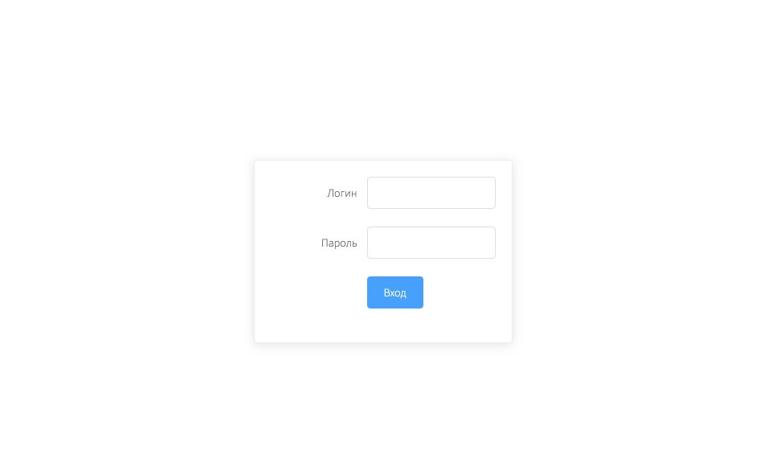
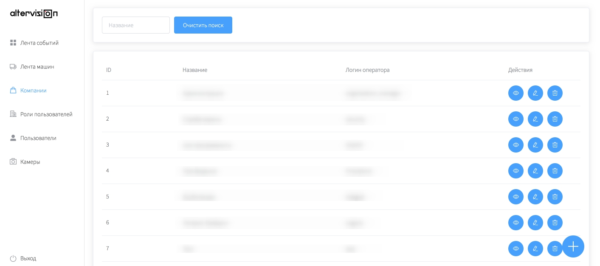
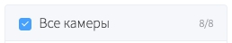

# Система видеонаблюдения "AlterVision". Руководство пользователя

# 1 Введение
## 1.1  Область применения

АИС "AlterVision" предназначена для информационного обеспечения процессов безопасности на любом объекте, оборудованном камерами видеонаблюдения. АИС – это система распознавания лиц: она автоматически создаёт и сохраняет в единый реестр снимки с камер наблюдения и сопоставляет их с реестром посетителей охраняемого объекта. Это позволяет службе безопасности предприятия установить точное время, в которое посетитель или его ТС (транспортное средство) попало в зону обзора камеры.

Для начала работы с установленной АИС необходима как минимум одна камера видеонаблюдения, соответствующая требованиям (2.1). Поэтому АИС может использоваться как в коммерческих, так и государственных или общественных предприятиях.

## 1.2 Краткое описание возможностей

АИС позволяет управлять системой камер наблюдения. Система:
* распознаёт посетителей на снимках и позволяет отслеживать их перемещение при помощи поиска по реестру событий;
* автоматически создаёт снимок с камеры наблюдения, как только лицо посетителя попадает в поле обзора камеры;
* распознаёт и автоматически сохраняет номер ТС (транспортного средства), как только ТС попадает в поле обзора камеры;
* сохраняет все автоматические снимки камер наблюдения в едином реестре;
* позволяет создавать и редактировать профили сотрудников организаций охраняемого объекта, чтобы система могла распознать их на снимках;
* выполняет функции системы автоматического открывания дверей: если дверь или турникет подключены к вызывной IP-панели (2.2.3), АИС распознаёт посетителя и формирует команду открывания двери, при условии, что посетителю предоставлен соответствующий доступ (8.3);
* позволяет посетителям объекта создавать профили через гостевой терминал (7.3). После этого АИС распознаёт посетителей на снимках так же, как и сотрудников организаций охраняемого объекта;
* автоматически создаёт видеозаписи с камер видеонаблюдения, как только в поле обзора камеры зафиксировано движение. Сохраняет видеозаписи в архив, где они доступны для просмотра и скачивания.

## 1.3 Пользовательские роли и уровень подготовки пользователя

Для эксплуатации АИС "AlterVision" определены роли:
* Администратор – сотрудник охраняемого объекта, который отвечает за создание профилей компаний и операторов и подключение камер к АИС;
* Оператор – сотрудник организации охраняемого объекта, который отвечает за создание профилей сотрудников в АИС;
* Сотрудник Охраны;
* Гость.

Администратор должен обладать соответствующим уровнем квалификации для того, чтобы:
* Создавать в АИС профили организаций и операторов охраняемого объекта;
* Разрабатывать политики доступа операторов к АИС;
* Предоставлять операторам доступ к АИС (логин и пароль);
* Связываться с разработчиком АИС "AlterVision" для подключения новых камер наблюдения к АИС.

Оператор должен свободно осуществлять стандартные операции:
* Создавать профили сотрудников своей организации в реестре пользователей;
* Отслеживать события в АИС и предоставлять другим сотрудникам своей организации доступ к этой информации по запросу;
* Поиск сотрудников в реестре пользователей.

Сотрудник Охраны должен свободно осуществлять стандартные операции:
* Отслеживать события в АИС;
* Поиск посетителей в реестре пользователей;
* Поиск снимков и видеозаписей в АИС.

Роль Гостя нужна, чтобы посетители охраняемого объекта могли самостоятельно создавать свои профили в системе (добавлять фото, указывать личные данные и компанию) при помощи терминала с установленной АИС "AlterVision". Для взаимодействия с системой Гостю не требуется специальных знаний и знакомства с настоящим руководством – подсказки предусмотрены в интерфейсе.

## 1.4 Перечень эксплуатационной документации

* АИС "AlterVision". Руководство пользователя.
* АИС "AlterVision". Руководство администратора.
* АИС "AlterVision". Описание архитектуры.

# 2. Программные и аппаратные требования

## 2.1 Программные и аппаратные требования для установки дистрибутива

Минимальные аппаратные требования к серверу для установки дистрибутива:

* Операционная система: Ubuntu 20.04;
* CPU: Intel Xeon W-2223, 3,6GHz;
* RAM: 4x Micron MTA9ASF1G72PZ-2G9E1, 4x8Gb;
* MB: Supermicro MBD-X11SRM-F-O;
* SDD: Intel 3710, 400Gb;
* HDD: 2x Western Digital 0F31284, 2x14Tb;
* Case: Supermicro CSE-731i-300B, mATX;
* PSU: SeaSonic SS-600ET, 600Вт.

## 2.2 Аппаратные требования к дополнительным устройствам для подключения к АИС "AlterVision"

Для начала работы с установленной АИС необходима как минимум одна камера видеонаблюдения.

Гостевой терминал не требуется для установки системы, но позволяет раширить функционал: через терминал Гости могут самостоятельно создавать профили Пользователя – так система сможет распознать снимки с ними и сохранить их.

Чтобы использовать АИС "AlterVision" в качестве системы автоматического открывания дверей, потребуется дополнительное оборудование: вызывные IP-панели и магнитные двери и турникеты, которые к ним подключаются.

### 2.2.1 Камеры видеонаблюдения

Минимальные технические характеристики камеры, которую можно подключить:
* Разрешение: 1920x1080;
* Протокол подключения: rtsp;
* Подключение к сети: через ethernet;
* Частота: 30 кадров в секунду;
* Поддержка обнаружения движения;
* ИК-подсветка ночная.

### 2.2.2 Гостевые терминалы

Гостевой терминал – это набор оборудования (сенсорный инфорационный киоск, камера, сканер паспорта) для дополнительных  функционала АИС.

Здесь приведены минимальные технические характеристики дополнительного оборудования, которое понадобится для подключения АИС. Для подключения оборудования и установки системы, заказчику АИС нужно связаться с разработчиком по контактам, указанным в договоре.

*Киоск информационный сенсорный:*
* Материнская плата ASROCK H310CM-HDV.
* Процессор INTEL Celeron G4930, LGA 1151v2, OEM.
* Оперативная память DDR4 - 4ГБ.
* 120 ГБ SSD накопитель.

*USB-камера (UVC):*
* Разрешение: 1920x1080;
* Протокол USB 2.0;

*Сканер паспорта 24 бит:*
* OCR ID сканер;
* Сенсорный акустический экран, 6 мм, 19";
* Кабель видеосигнала HDMI-HDMI.

### 2.2.3 Вызывные IP-панели

Вызывная панель – это специальное оборудование для магнитной двери или турникета, необходимое, чтобы система могла распознать посетителя и открыть дверь или турникет автоматически. Для этого вызывная панель должна быть оборудована камерой наблюдения.

Подключение вызывной панели к АИС "AlterVision" осуществляется Администратором (4).

Здесь приведены рекомендуемые технические характеристики IP-панели:
* 2 Мп HD-камера с ночной ИК-подсветкой;
* Разрешение камеры: 1920x1080;
* Поддержка обнаружения движения;
* Протокол подключения: rtsp;
* Подключение к сети: через ethernet.

# 3. Подготовка к работе и запуск системы.

## 3.1 Состав дистрибутива АИС "AlterVision" и устройство системы

Дистрибутив АИС "AlterVision" инсталлируется разработчиком на сервер заказчика.

Клиентская часть не требует инсталляции. Для работы с клиентской частью АИС необходим браузер (например, Google Chrome, Chromium, Safari).

## 3.2 Порядок проверки работоспособности

Для проверки доступности системы с рабочего места сотрудника (Администратора, Оператора, Сотрудника Охраны) необходимо выполнить следующие действия:
 1. Ввести в адресную строку браузера адрес, указанный в договоре, и нажать «Переход»;
 2. В форме аутентификации ввести пользовательский логин и пароль (3.3):

   

 3. Нажать кнопку «Вход»;
 4. Убедиться, что в окне открылся Стартовый экран:

   

Состав разделов АИС, доступных на этом экране в левой панели, зависит от пользовательской роли, под которой был совершён вход в систему.

Администратору должны быть доступны разделы:
1. Лента событий;
2. Лента машин;
3. Компании;
4. Роли пользователей;
5. Пользователи;
6. Камеры;
7. Архив.

Оператору должны быть доступны разделы:
1. Лента событий;
2. Роли пользователей;
3. Пользователи.

Сотруднику Охраны должны быть доступны разделы:
1. Лента событий;
2. Роли пользователей;
3. Пользователи;
4. Архив.

В качестве контрольного примера можно использовать примеры по каждому пункту, приведенному в разделах 4-10 руководства.

## 3.3 Администратору / Оператору / Cотруднику Охраны: подготовка к работе и запуск системы

Для входа в систему:
1. В адресную строку браузера ввести адрес, указанный в договоре.
2. В появившемся окне указать данные для входа:
    2. Логин / пароль Администратора и Сотрудника Охраны указаны в договоре.
    2. Логин / пароль Оператора устанавливаются Администратором в разделе «Создание профиля компании» (5).
3. Нажать кнопку «Вход».

# 4. Администратору: Камеры

В разделе «Камеры» Администратор может:
* подключить к системе камеру или вызывную IP-панель;
* задать имя для каждой подключённой камеры или IP-панели, которое затем можно использовать в настройках профиля компаний (5) и профиля пользователя (6).

После того как камера подключена, её нужно добавить в созданный профиль компании (5) и к пользовательской роли (6), а также создать пользователей (7) для того, чтобы АИС могла определить посетителей на сохранённых снимках.

Вызывные IP-панели имеют схожий с камерами принцип подключения. Подключенные панели отображаются в этом же разделе как камеры. Если IP-панель подключена к системе, и добавлена к настройкам профиля компании (5) и к пользовательской роли (6), АИС начинает работать как система автоматического открывания дверей или турникетов, сопряжённых с IP-панелями, для тех пользователей, в пользовательской роли которых указана (7.1.5) конкретная IP-панель.

Чтобы подключённая камера записывала видео и сохраняла его, её нужно дополнительно подключить в разделе «Архив» (10). Камеры, добавленные Администратором в раздел «Камеры» не будут по умолчанию сохранять видеозаписи.

## 4.1 Условия подключения камеры и вызывной IP-панели к АИС

Для подключения камеры или вызывной IP-панели, нужно предварительно установить её, подключить к сети (присвоить IP-адрес) и активировать согласно инструкции компании-производителя. IP-адрес устройства в сети будет использоваться для подключения его к АИС.

## 4.2 Администратору: подключение камеры или вызывной IP-панели

Чтобы подключить камеру, нужно:
1. Перейти в раздел «Камеры»;
2. Нажать на значок добавления:

3. Ввести IP-адрес, присвоенный камере или вызывной IP-панели при установке (4.1);
4. Задать название камеры;
4. Подтвердить подключение – нажать «Создать».

Для подключённой камеры или IP-панели можно изменить название (4.3), чтобы затем быстрее найти её в настройках.

## 4.3 Администратору: редактирование названия камеры или вызывной IP-панели

Администратор может изменить название камеры или вызывной IP-панели, чтобы затем использовать это название в настройках системы, например, в настройках профиля компании (5) или профиля пользователя (6).

Чтобы изменить название, нужно:
1. Перейти в раздел «Камеры»;
2. Выбрать камеру из списка подключённых;
3. Перейти к редактированию:

4. Задать название камеры;
5. Подтвердить изменение – нажать «Редактировать».

# 5. Администратору: профиль компании

Профиль компании – это набор настроек учётной записи для Оператора, которые определяют:
* логин и пароль для учётной записи Оператора;
* набор камер, снимки и распознанные номера ТС с которых будут доступны Оператору в его профиле;
* набор вызывных-IP панелей (в этом разделе отображаются как камеры), которые будут доступны Оператору в его профиле.

Для входа в систему Оператор использует логин и пароль, которые были созданы Администратором в этом разделе.

Оператор может видеть снимки только тех камер, которые подключены к профилю компании. Операторы других компаний (при входе в систему под своей учётной записью) не будут видеть снимки с камер, которые не привязаны к профилю компании Администратором.

Только после создания компании можно добавлять Пользователей для того, чтобы система могла распознавать их на снимках в дальнейшем.

## 5.1 Условия создания профиля компании

Для создания профиля компании необходима хотя бы одна камера, подключённая к системе (4).

## 5.2 Создание профиля компании

Чтобы создать профиль компании, нужно:
1. Перейти в раздел «Компании».
2. Задать имя компании.
3. Выбрать камеры из списка «Все камеры» и нажать стрелку:
    
Выбранные камеры переместятся в список «Доступные этой компании». Вызывные IP-панели и камеры, которые распознают номера ТС будут отображаться в списке «Все камеры».
4. Задать логин оператора. Логин Оператора нельзя изменить.
5. Задать пароль Оператора и подтвердить его.
5. Подтвердить создание профиля – нажать «Создать».

Теперь Оператор может зайти в систему под заданным паролем.
После создания компания отобразится в списке.

Чтобы отредактировать имя компании, пароль оператора и список доступных камер, нужно нажать на иконку редактирования напротив копании в списке:
   

# 6. Администратору: Роли пользователей

Пользовательская Роль определяет:
* снимки посетителя с каких камер будут отображаться в Ленте событий как «Известные» (8.2), а с каких – нет;
* какие камеры будут распознавать номера ТС на снимках и сохранять события в «Ленте машин» (9.1);
* какие вызывные IP-панели будут открывать двери (8.3) для посетителя, а какие – нет.

Назначить пользователю роль можно на шаге 7 (Администратору: создание пользователя).

* Если посетитель из списка «Пользователи» попал на снимок камеры, которая не привязана к его пользовательской роли, то в «Ленте событий» снимок с ним будет отображаться как «Не найден» – как если бы этого посетителя не было в списке пользователей.
* Роль можно назначить только пользователям конкретной компании – одна пользовательская роль не может быть назначена пользователям из разных компаний.
* У одного пользователя может быть несколько ролей.

После подключения новых камер или вызывных IP-панелей к системе, их нужно будет последовательно добавить сначала в профиль компании (5.2), а затем – в уже созданные роли.

## 6.1 Условия создания пользовательской роли

Для создания пользовательской роли необходимо создать профиль компании (5).

## 6.2 Создание пользовательской роли

Чтобы создать Роль, нужно:
1. Перейти в раздел «Роли пользователей».
2. Задать имя роли.
3. Выбрать камеры из списка «Все камеры» и нажать стрелку:
 Выбранные камеры переместятся в список «Доступные этой роли».
    1. Чтобы добавить к роли все камеры, доступные компании, нужно нажать на галочку:  и переместить выбранные камеры в список доступных роли (нажать на стрелку):
     Такую Роль можно назначать Пользователям из «Списка пользователей» по умолчанию, чтобы все камеры компании распознавали их.
4. Подтвердить создание роли – нажать «Создать».

После создания Роль отобразится в списке.

Чтобы отредактировать имя Роли и список доступных камер, нужно нажать на иконку редактирования напротив имени роли в списке:
    

# 7. Администратору / Оператору: Пользователи

Пользователь – это набор данных посетителя или гостя, нужных системе, чтобы распознать снимки с камер в Ленте машин (9) и Ленте событий (8). Каждый профиль пользователя содержит поля, описанные в разделах 7.1.1 - 7.1.2.

## 7.1 Условия создания пользователя

Чтобы начать добавлять пользователей в список, нужно создать хотя бы одну пользовательскую Роль (6.2).

Пользователя может создать (добавить в список «Пользователи»):
* Администратор в разделе «Пользователи». Профиль пользователя хранится в «Списке пользователей» до тех пор, пока администратор не удалит их.
* Оператор в разделе «Пользователи».
* Гости – профиль создаётся Гостем через гостевой терминал. После этого профиль пользователя добавляется в список «Пользователи» и хранится в нём до тех пор, пока Администратор не удалит его.

Для создания Пользователя необходимо заполнить обязательные поля формы. При создании Пользователя через гостевой терминал, АИС автоматически заполняет данные профиля Пользователя.

Гости самостоятельно создают профиль Пользователя через гостевой терминал (2.2) с установленной АИС. Процесс создания пользователя Гостем рассмотрен в разделе 7.2.

### 7.1.1 Профиль пользователя. Компания

Обязательное поле. Необходимо для того, чтобы:
1. Указанная Компания отображалась в «Известных» снимках «Ленты событий» (8.2).
2. Снимки посетителя только с тех камер, которые привязаны к профилю этой Компании (5.2), получали статус «Известный» в Ленте событий (8.2).
3. Только вызывные панели, указанные Администратором в профиле Компании (5.2), открыли двери для посетителя (8.3).

По Компании Оператор, Администратор и Сотрудник Охраны могут искать профиль Пользователя (7.8) в «Списке пользователей».

### 7.1.2 Профиль пользователя. Фото

*Обязательное поле.* Необходимо, чтобы АИС могла идентифицировать посетителя на снимках камеры.

При создании профиля Администратором, фото должно соответствовать требованиям:
- На фото должно быть чёткое изображением лица строго в анфас.
- Минимальный размер лица на фото 120x120 пикселей.
- Допустимые форматы файла с фото: PNG, JPEG.

При создании профиля Гостем камера терминала с установленной АИС создаёт его фото в требуемом формате и с необходимым разрешением.

### 7.1.3 Профиль пользователя. Фамилия и Имя

*Обязательные поля.* Необходимы для того, чтобы указанные данные отображались в «Известных» снимках «Ленты событий» (8.2). По Имени и Фамилии Оператор и Администратор могут искать профиль пользователя (7.8) в «Списке пользователей».

### 7.1.4 Профиль пользователя. Должность

Необязательное поле. Необходимо для того, чтобы: указанная Должность отображалась в «Известных» снимках «Ленты событий» (8.2). По данным, указанным в Должности, Оператор и Администратор могут искать профиль пользователя (7.8) в «Списке пользователей».

Профили пользователей, которые создают Гости, получают Должность «Гость».

### 7.1.5 Профиль пользователя. Роль

*Обязательное поле.* В этом поле доступны для выбора те Роли, которые Администратор создал в разделе «Роли пользователей» (6). Одному пользователю можно назначить несколько ролей.

Роль определяет:
* снимки посетителя с каких камер будут отображаться в Ленте событий как «Известные» (8.2), а с каких – нет;
* какие камеры будут распознавать номера ТС на снимках и сохранять события в «Ленте машин» (9.1);
* какие вызывные IP-панели будут открывать двери (8.3) для посетителя, а какие – нет.

Профили пользователей, которые создают Гости, получают Роль «Гость» автоматически.

### 7.1.6 Профиль пользователя. Номер авто

Необязательное поле. Необходимо для того, чтобы камеры могли распознавать указанный государственный номер ТС, как только транспортное средство попало в поле обзора камеры, и сохранить его как Событие в «Ленте машин» (9.1).

### 7.1.7 Профиль пользователя. Фото паспорта

*Обязательное поле для профилей, которые создаются Гостями через гостевой терминал (2.2)*. Хранит ссылку на фото документа, удостоверяющего личность. Позволяет Администратору и Оператору просмотреть фото документа и сохранить его.

## 7.2 Администратору / Оператору: cоздание, редактирование, удаление пользователя

Чтобы создать профиль Пользователя, нужно:
1. Перейти в раздел «Пользователи» и нажать на «+».
2. Выбрать Компанию из выпадающего списка.
3. Заполнить обязательные поля формы (см. 7.1.1 - 7.1.5). Если обязательное поле не заполнено, АИС выведет ошибку, и Пользователь не будет создан.
4. Подтвердить создание профиля – нажать «Создать».

Созданные Администратором профили Пользователей доступны Оператору только для просмотра (не для редактирования или удаления).

Удалить Пользователя из списка или отредактировать его данные может только Администратор. Для этого нужно нажать на иконку редактирования напротив Пользователя в списке:

## 7.3 Создание пользователя через гостевой терминал

Чтобы создать профиль Пользователя, в гостевом терминале нужно:
1. Нажать «Пройти проверку».
2. Ввести фамилию и имя и подтвердить ввод.
3. Выбрать Компанию из списка.
4. Система предложит сделать фото. Гость может подтвердить создание фото или нажать «Переснять», чтобы заменить уже созданное фото.
3. В этом шаге нужно поднести к сканеру паспорта документ, удостоверяющий личность. АИС автоматически создаст снимок паспорта и сохранит его.

После этого профиль пользователя автоматически добавляется в список «Пользователей». Администратор может отредактировать данные такого профиля или удалить его.

## 7.8 Администратору / Оператору / Сотруднику охраны: Поиск пользователя

В разделе можно искать профили Пользователей, созданные гостями и Администратором по следующим данным:
1. Имя. Для поиска достаточно ввести один символ. АИС выведет список всех Пользователей, Имя которых содержит указанные символы.
2. Фамилия. Для поиска достаточно ввести один символ. АИС выведет список всех Пользователей, Фамилия которых содержит указанные символы.
3. Компания. Для поиска нужно выбрать одну или несколько Компаний из списка.
4. Должность. Для поиска достаточно ввести один символ. АИС выведет список всех Пользователей, Должность которых содержит указанные символы.

Если в АИС нет Пользователей, удовлетворяющих условиям поиска, в результатах поиска отображается ошибка. Можно очистить поиск и попробовать ввести другие данные в полях ли часть полей поиска

# 8 Администратору / Оператору / Сотруднику Охраны: Лента событий

Лента событий – это реестр, в котором хранятся все снимки посетителей с камер наблюдения и предусмотрена возможность поиска по ним.

Для каждого снимка в Ленте событий отображается:
* имя камеры или вызывной IP-панели (4.2);
* статус распознания снимка (8.2): Пользователь и Компания / «Неизвестный»;
* дата и время создания снимка с точностью до секунд.

## 8.2 Условия создания События и распознания посетителя на снимке

Камеры наблюдения, подключенные к АИС, создают снимок (Событие), как только лицо посетителя попадает в поле камеры наблюдения.

Затем АИС присваивает снимку статус:
1. *«Известный»*. В поле «Пользователь» для такого снимка будет отображаться Имя и Фамилия(7.1.3), и Должность (7.1.4), которые указаны в профиле существующего Пользователя (7), а в поле «Компания» – Компания (7.1.1) этого Пользователя.
2. *Неизвестный*. Для таких снимков в Ленте событий не отображается Имя, Фамилия, Компания и должность пользователя, но предусмотрена возможность поиска (8.3  Нераспознанные снимки получают статус «Незвестный» с возможностью поиска по ним.

Администраторы и Сотрудники охраны в Ленте событий видят все снимки как «Известные».

Операторы видят как «Известные» снимки только тех пользователей, которые привязаны к профилю их компании.

Распознание произойдёт, если соблюдены следующие условия:
1. Пользователь есть в списке «Пользователи» – для него создан профиль Администратором или Гостем через гостевой терминал.
2. Камера, которая сделала снимок, привязана к Компании этого Пользователя (5.2).
4. Камера, которая сделала снимок, привязана к Роли этого Пользователя (7.6).
Распознанные снимки получают статус «Известный» с возможностью поиска по ним.

Если снимок не распознан, в поле «Пользователь» будет отображаться «не найден». Это может произойти в нескольких ситуациях:
1. Пользователя нет в списке «Пользователи» – для него не создан профиль Администратором.
2. Камера, которая сделала снимок, не привязана к Компании этого Пользователя (5.2).
4. Камера, которая сделала снимок, не привязана к Роли этого Пользователя (7.6).

## 8.3 Условия срабатывания системы открывания дверей

Если к АИС в разделе «Камеры» привязаны вызывные IP-панели, они позволяют автоматически открывать двери (турникет) для посетителя.

Автоматическое срабатывание системы открывания дверей произойдёт, если соблюдены следующие условия:
1. Пользователь есть в списке «Пользователи» – для него создан профиль Администратором, Оператором или Гостем через гостевой терминал.
2. Вызывная IP-панель привязана к Компании этого Пользователя (5.2).
4. Вызывная IP-панель привязана к Роли этого Пользователя (7.6).

Автоматическое срабатывание не произойдёт, если:
1. Пользователя нет в списке «Пользователи» – для него не создан профиль Администратором.
2. Вызывная IP-панель не привязана к Компании этого Пользователя (5.2).
4. Вызывная IP-панель не привязана к Роли этого Пользователя (7.6).

## 8.4 Администратору / Оператору / Сотруднику Охраны: Поиск снимков в Ленте событий

В разделе «Лента событий» предусмотрено несколько режимов поиска.

### 8.4.1 Обычный поиск

Позволяет искать События по фильтрам поиска:
1. Дата и время. Для поиска нужно указать диапазон дат в выпадающем меню и подтвердить выбор («ОК»). АИС позволяет искать все снимки, сделанные камерами в указанное время с точностью до секунд.
2. Камера. Для поиска нужно выбрать одну или несколько Камер из списка.
3. Статус распознания снимка («Известный» / «Неизвестный» / «Любой»).
4. Компания. Для поиска нужно выбрать одну или несколько Компаний из списка.

### 8.4.2 Расширенный поиск по фото

Позволяет искать События по фото:

1. Фото. Для поиска нужно загрузить фото, на котором видно лицо анфас или в профиль в формате JPEG или PNG, например, фото из паспорта.
2. Точность поиска. Определяет, насколько лицо на снимке должно быть похоже на лицо на загружаемой фотографии. Если установить минимальное значение (40%), в результатах поиска отобразятся все снимки, которые система распознания лиц определила как похожие. Для значения 100% подходят ранее сохранённые снимки из Ленты событий – АИС отобразит только соответствующее им Событие в результатах поиска.

Сузить результаты поиска можно при помощи фильтров обычного поиска (8.4.1).

### 8.4.3 Расширенный поиск по имени

Для поиска нужно выбрать одного или нескольких сотрудников из списка. Сузить результаты поиска можно при помощи фильтров обычного поиска (8.4.1).

# 9 Администратору: Лента машин

Лента машин – это реестр, в котором сохраняются все События, которые АИС создаёт, когда камера наблюдения фиксирует номер ТС. Предусмотрена возможность поиска по Событиям.

Для каждого События в Ленте машин отображается:
* имя Пользователя;
* Компания;
* дата и время создания События с точностью до секунд.

## 9.1 Условия создания События Ленты машин

Камеры наблюдения, подключенные к АИС, фиксируют номер ТС, как только он попадает в поле обзора камеры наблюдения. Событие создаётся, если номер ТС указан в одном из профилей Пользователей (7.1.6).

## 9.1 Администратору: Поиск Событий в Ленте машин

Позволяет искать События по следующим фильтрам:
1. Имя Пользователя. Для поиска нужно выбрать одного или нескольких Пользователей из списка.
2. Компания. Для поиска нужно выбрать Компанию из списка.
3. Номер авто. Для поиска нужно ввести номер авто в формате «н000нн00». Поиск по части символов номера ТС, например по номеру региона («178») не предусмотрен.
4. Дата и время. Для поиска нужно указать диапазон дат в выпадающем меню и подтвердить выбор («ОК»). АИС позволяет искать все снимки, сделанные камерами в указанное время с точностью до секунд.

# 10 Администратору / Сотруднику Охраны: Архив

В разделе Архив хранятся видеозаписи с камер наблюдения. Есть возможность поиска по видеозаписям и просмотра видео.

# 10.1 Условия создания видеозаписи

Камеры наблюдения, подключенные к АИС, делают запись видео, как только фиксируют движение в поле обзора. Как только движущийся объект исчезает из поля обзора камеры, запись останавливается, а видео сохраняется в Событие архива.

Для того, чтобы камеры видеонаблюдения сохраняли видеозаписи в Архив, нужно отдельно подключить в этом разделе те камеры, которые будут сохранять видео.

# 10.2  Администратору / Сотруднику Охраны: подключение камеры к Архиву

При подключении камеры для записи видео используется дополненный набор настроек. который можно расширить, если для подключения к системе используются нестандартные режимы подключения камер, например, IP-камеры, подключённые к локальным компьютерам по USB.

Для подключения предустановленной (4.1) согласно инструкции компании-производителя IP-камеры достаточно использовать набор настроек, описанный в этом разделе руководства.

Для использования любых настроек, кроме описанных в этом разделе, рекомендуется предварительно связаться с разработчиком АИС "AlterVision" по контактам, указанным в договоре.

Чтобы подключить камеру, которая будет сохранять видео в Архив, нужно:
1. Перейти в раздел «Архив» -> «Камеры» -> «Добавить».
2. В появившемся модальном окне установить настройки, описанные в разделах 10.2.1 - 10.2.2.

## 10.2.1 Подключение камеры к Архиву. Источник (Source).

На вкладке «Источник» (Source) необходимо указать источник сигнала для записи видео – IP-камеру: заполнить поля, перечисленные в разделах 10.2.1.1 – 10.2.1.3. Остальные поля оставить пустыми или заполненными значениями по умолчанию.

### 10.2.1.1 Источник (Source). Ссылка на источник сигнала (Source path)

Адрес RTSP-потока подключаемой камеры. Актуальный адрес RTSP-потока можно уточнить в разделе настроек камеры или на сайте производителя.

Как правило, RTSP-адрес указывается в формате (подходит для большинства IP-камер):
  rtsp://199.255.20.999:554/user=LOGIN&password=PSWRD&channel=1&stream=0.cgi.

Где:
* "LOGIN"/"PSWRD" – имя пользователя и пароль, заданные для этой камеры при её установке (4.1);
* 199.255.20.999 – IP-адрес камеры;
* 554 – RTSP-порт камеры, указанный в настройках при установке (4.1).

### 10.2.1.2 Источник (Source). Метод подключения (Method)

Метод подключения камеры к АИС. Выбрать TCP из предложенных вариантов.

### 10.2.1.3 Источник (Source). Разрешение (Capture Resolution)

Разрешение выбранной камеры. Необходимо выбрать из списка или указать разрешение камеры, указанное при её установке (4.1).

## 10.2.2 Подключение камеры к Архиву. Общие настройки (General)

На вкладке «Общие настройки» (General) необходимо задать режим работы ранее подключенной IP-камеры (10.2.1): заполнить поля, перечисленные в разделах 10.2.2.1 – 10.2.2.3. Остальные поля оставить пустыми или заполненными значениями по умолчанию.

### 10.2.2.1 Общие настройки (General). Имя камеры (Name)

Указать имя камеры, по которому записи с неё можно будет найти в архиве (10.3). Имя должно состоять только из латинских символов и цифр (a-z, A-Z, 0-9), дефиса (-) и подчеркивания (_) без пробелов.

### 10.2.2.2 Общие настройки (General). Тип источника сигнала (Source type)

Выбор того или иного варианта влияет на набор параметров, отображаемых на вкладке «Источник».

Этот раздел определяет, является ли камера локальной, подключенной к физическому видео- или USB-порту на локальном компьютере, сетевой камерой (стандартный вариант подключения) или источником данных для записи видео вместо  IP-камеры может быть файл (периодически загружаемый из внешнего источника).

Для стандартного способа подключения большинства IP-камер к АИС (с использованием RSTP-протокола) – рекомендуемый тип источника сигнала – "FFmpeg". АИС использует источник сигнала, указанный в разделе 10.2.1.1.

### 10.2.2.3 Общие настройки (General). Режим записи (Function)

Этот раздел:
1. Определяет режим записи камеры: какое событие будет являться сигналом (триггером) для записи видео и сохранения его в Архив, например, любое движение в поле обзора камеры (режим Движение (Modect)).
2. Позволяет отключить камеру для записи, не удаляя её настроек (режим «Нет» (None)).

Доступные режимы записи:
* Нет (None) - камера отключена для записи и просмотра видео.
* Движение (Modect) - как только АИС зафиксирует движение в поле обзора камеры, камера перейдёт в режим записи видео до тех пор, пока движение не прекратится. Видеозапись сохранится в разделе Архив и будет доступна для поиска (10.3).
* Запись (Record) - камера будет непрерывно создавать События (10.3) фиксированной длины и сохранять их в Архив (10.3). В этом режиме обнаружение движения не происходит.
* Движение и запись (Mocord) - камера будет непрерывно создавать в Архиве как события фиксированной длины, так и записи движения, если АИС зафиксировала движение в поле обзора камеры. В разделе поиска (10.3) будет указана причина, по которой сохранена видеозапись.

# 10.3  Администратору / Сотруднику Охраны: поиск видеозаписей в Архиве

Позволяет искать видеозаписи по следующим фильтрам:
1. Дата и время. Для поиска нужно указать диапазон дат в выпадающем меню и подтвердить выбор («ОК»). АИС позволяет искать все видеозаписи, сделанные в указанное время с точностью до секунд.
2. Камера. Для поиска нужно указать одну или несколько Камер из списка.
3. Режим записи. Hастроенный в разделе 10.2.2.3 сигнал (триггер) для записи видео:
    * «Движение» – видеозаписи, созданные и сохранённые после того, как АИС зафиксировала движение в поле обзора камеры.
    * «Запись» – видеозаписи, созданные и сохранённые в режиме непрерывной записи.
3. Название События. По умолчанию АИС присваивает Событию стандартное название с порядковым номером. Название может быть изменено при редактировании (10.3).

# 10.4  Администратору / Сотрудику Охраны: просмотр, загрузка и редактирование видеозаписей

При нажатии на Событие в списке, видеозапись откроется в новом окне.
Предусмотрены возможности:
1. *Просмотреть видеозапись*. Чтобы ускорить просмотр или перейти к нужному моменту видео, можно использовать стандартные функции встроенного проигрывателя видеофайлов:

2. *Загрузить видеозапись на локальный компьютер*: нажатие на «Загрузить» откроет стандартное окно загрузки браузера, в котором можно указать путь сохранения для файла на локальном компьютере в формате "mp4".
3. *Изменить Название События*: нажать «Переименовать», указать название и подтвердить изменение. Видеозапись в списке Архива будет отображаться с новым названием.
